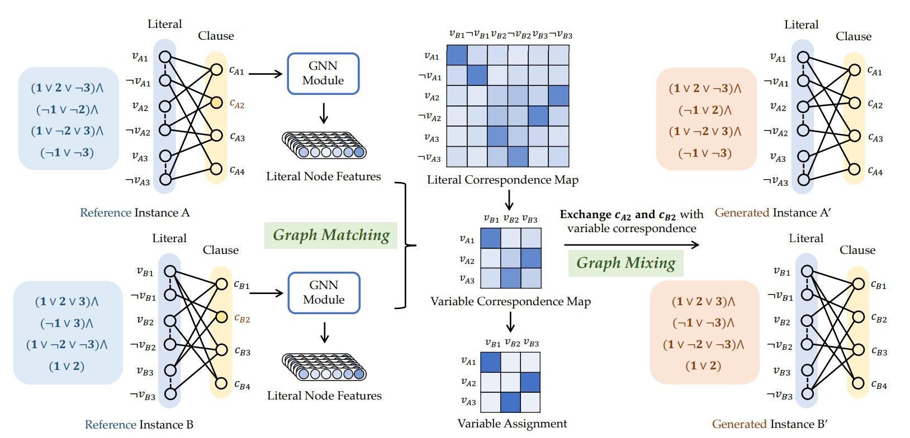

# [ICLR 2024] MixSATGEN: Learning Graph Mixing for SAT Instance Generation

Official implementation of ICLR 2024 paper [MixSATGEN: Learning Graph Mixing for SAT Instance Generation](https://openreview.net/pdf?id=PXXuLvIH5r).



**Abstract:** The Boolean satisfiability problem (SAT) stands as a canonical NP-complete task. In particular, the scarcity of real-world SAT instances and their usefulness for tuning SAT solvers underscore the necessity for effective and efficient ways of hard instance generation, whereas existing methods either struggle to maintain plausible hardness or suffer from limited applicability. Different from the typical construction-based methods, this paper introduces an adaptive and efficient graph interpolation approach that in place modifies the raw structure of graph-represented SAT instance by replacing it with a counterpart from another instance. Specifically, it involves a two-stage matching and mixing pipeline. The matching aims to find a correspondence map of literal nodes from two instance graphs via learned features from a matching network; while the mixing stage involves iteratively exchanging clause pairs with the highest correspondence scores until a specified replacement ratio is achieved. We further show that under our matching-mixing framework, moderate randomness can avoid hardness degradation of instances by introducing Gumbel noise. Experimental results show the superiority of our method with both resemblance in structure and hardness, and general applicability.

---

## Installation

-  Install the environment by the following steps:

  ```bash
  conda env create -f environment.yml
  conda activate mixsatgen
  pip install -r requirements.txt
  ```

- Please refer to  [G4SATBench](https://github.com/zhaoyu-li/G4SATBench) for installing `g4satbench`.

## Dataset Preparation

- Formula: `./dataset/${dataset_name}/${formula_name}.cnf`
- Instance pairs: `./dataset/${dataset_name}/pair_name.txt`, where each line corresponds to an instance pair. Order matters and the first entry indicates the mixing start. Note that the data and models generated in the matching phase can be reused during the mixing phase by reversing the start and end order within this file.

## Pretrained Model Preparation

- The model is pretrained with the SAT solving task implemented in [G4SATBench](https://github.com/zhaoyu-li/G4SATBench).

    ```bash
    # task=assignment
    # dataset=ca
    # graph=lcg
    # level=medium

    # train NeuroSAT on the easy SR dataset for satisfiability prediction
    python train_model.py assignment ~/g4satbench/medium/ca/train/ --train_splits sat --valid_dir ~/g4satbench/medium/ca/valid/ --valid_splits sat --loss unsupervised_2 --graph lcg --model neurosat --n_iterations 32  --lr 1e-04 --weight_decay 1e-08 --scheduler ReduceLROnPlateau --batch_size 32 --seed 123

    # evaluate NeuroSAT on the easy 3-sat dataset for satisfiability prediction
    python eval_model.py assignment ~/g4satbench/medium/ca/test/ runs/train_task\=assignment_difficulty\=medium_dataset\=ca_splits\=sat_label=None_loss=unsupervised_2/graph=lcg_init_emb=learned_model=neurosat_n_iterations=32_lr=1e-04_weight_decay=1e-08_seed=123/checkpoints/model_best.pt --test_splits sat --decoding standard --graph lcg --model neurosat --n_iterations 32 --batch_size 32
    ```

- The model checkpoints will be stored at: `path/to/G4SATBench/runs/train_task=assignment_difficulty=medium_dataset=ca_splits=sat_label=None_loss=unsupervised_2/graph=lcg_init_emb=learned_model=neurosat_n_iterations=32_lr=1e-04_weight_decay=1e-08_seed=123/checkpoints/model_best.pt`

## Run

1. Matching phase:
   - Build affinity matrix $K$ and finetune pretrained models:

    ```bash
    python src/main.py --mode train --match satbench --model neurosat --pretrain /path/to/g4satbench/best_model.pt --epoch 201 --lr 0.0001 --dataset ${dataset_name} --load_K --n_iterations 4
    ```

   - The affinities and the trained models correspond to the instance pair level and will be saved in `./data/${dataset_name}/`.
   - Note that this phase can be time-consuming and building affinity matrices may require large memory. We recommend separating affinity matrix building on CPU while conducting model finetuning on GPU, especially if the instances are not lightweighted (#variables >= 300).

2. Mixing phase:
   - Filter the improper instance pair with the entropy of the soft alignment matrix. The results will be stored in `dataset/${dataset_name}/entropy.txt`. A smaller value denotes more distinct matching relations, you can adjust instance pair in `pair_name.txt` for a better mixing performance.
    
    ```bash
    python src/main.py --mode test --match satbench --model neurosat --dataset ${dataset_name} --load_K --n_iterations 4 --entropy
    ```

    - Mix and generate new instances, applying different configurations if necessary. The commands below generates instances presented in the main experiments of the paper.
  
    ```bash
    # lambda = 0
    python src/main.py --mode test --match satbench --model neurosat --repeat 3 --mixing_thresh 0.05 --dataset ${dataset_name} --load_K --n_iterations 4
   
    # lambda = 0.1
    python src/main.py --mode test --match satbench --model neurosat --repeat 3 --mixing_thresh 0.05 --dataset ${dataset_name} --load_K --n_iterations 4 --enable_gumbel --gumbel_factor 0.1 --gumbel_temp 1.0
   
    # lambda = 0.5
    python src/main.py --mode test --match satbench --model neurosat --repeat 3 --mixing_thresh 0.05 --dataset ${dataset_name} --load_K --n_iterations 4 --enable_gumbel --gumbel_factor 0.5 --gumbel_temp 1.0
   
    # lambda = 1.0
    python src/main.py --mode test --match satbench --model neurosat --repeat 3 --mixing_thresh 0.05 --dataset ${dataset_name} --load_K --n_iterations 4 --enable_gumbel --gumbel_factor 1.0 --gumbel_temp 1.0
   
    # random
    python src/main.py --mode random --match rrwm --repeat 3 --mixing_thresh 0.05 --dataset ${dataset_name} --load_K
    ```

## Reference

```bibtex
@inproceedings{chen2024mixsatgen,
  title={MixSATGEN: Learning Graph Mixing for SAT Instance Generation},
  author={Chen, Xinyan and Li, Yang and Wang, Runzhong and Yan, Junchi},
  booktitle={The Twelfth International Conference on Learning Representations},
  year={2024}
}
```

## Acknowledgment

This repository is built upon [HardSATGEN](https://github.com/Thinklab-SJTU/HardSATGEN) and [G4SATBench](https://github.com/zhaoyu-li/G4SATBench)
